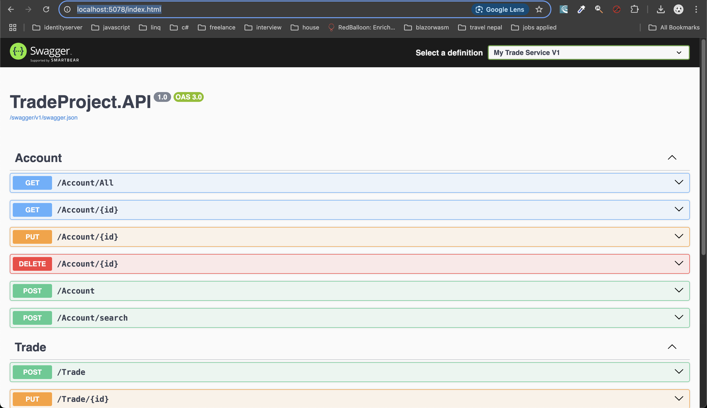
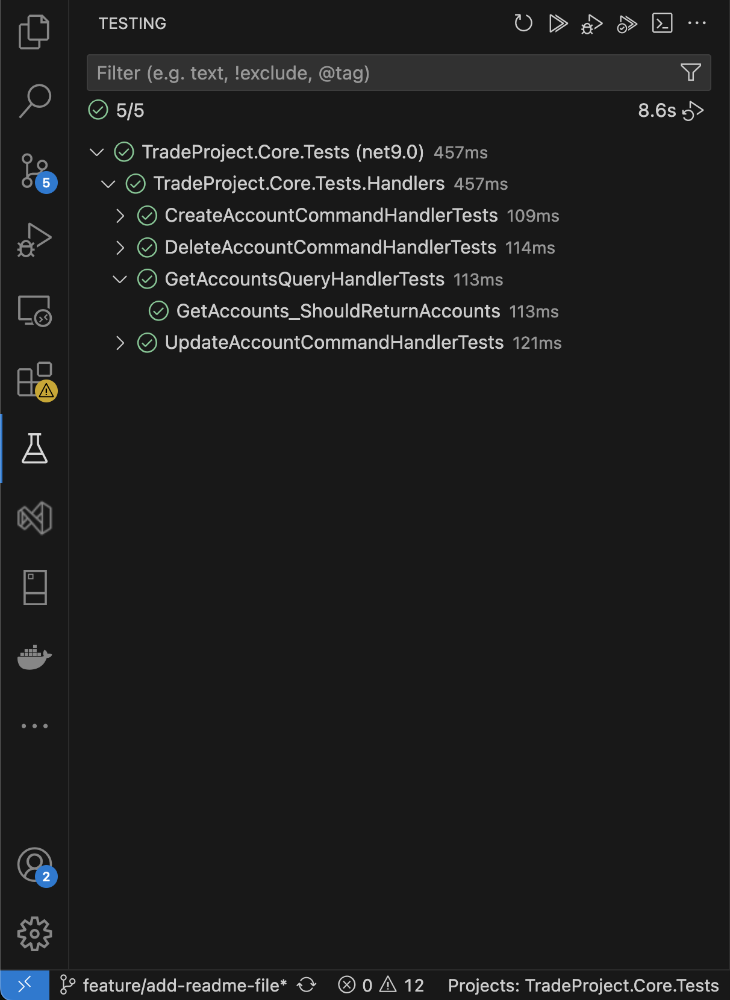
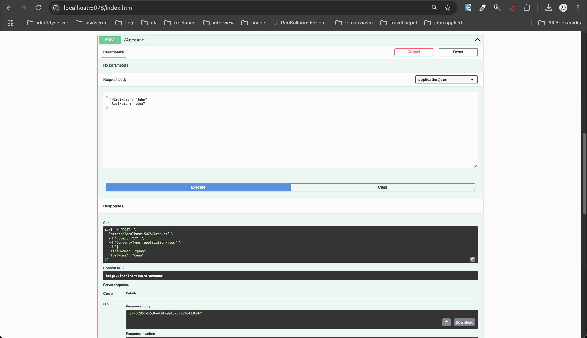
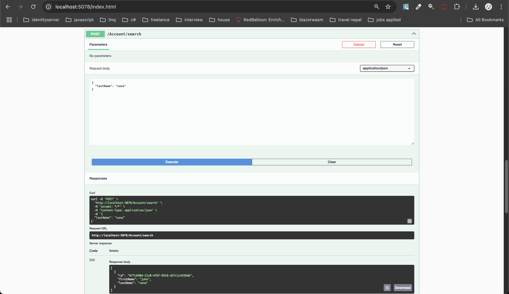
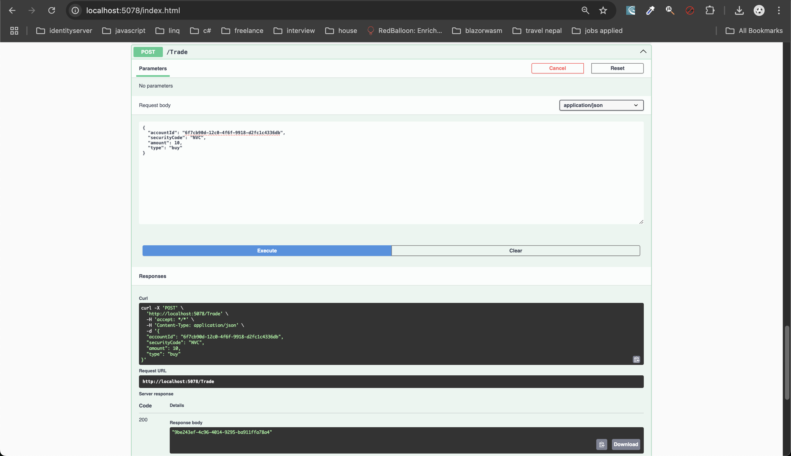
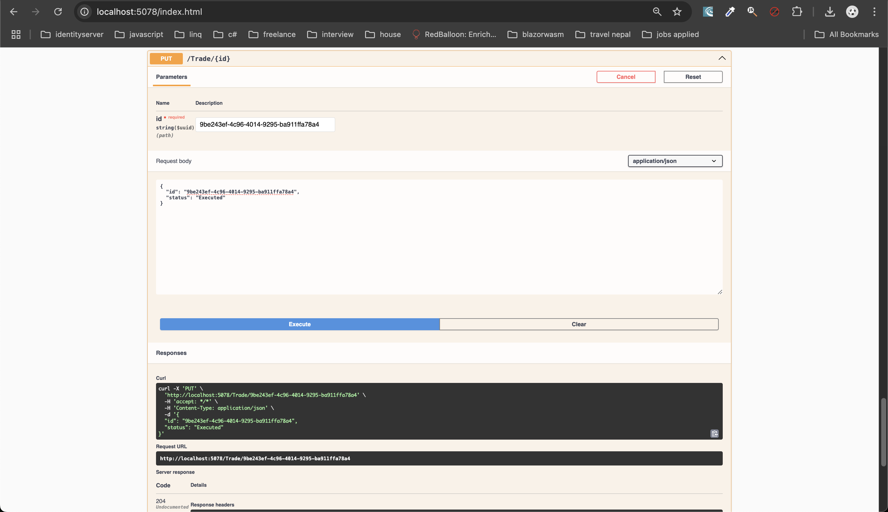

# Trade Project

## Overview

This project is a .NET application that follows the principles of Clean Architecture and utilizes the MediatR library for implementing the mediator pattern. The application is backed by a PostgreSQL database, which can be setup by Docker.

### Clean Architecture

Clean Architecture is a software design philosophy that emphasizes separation of concerns, making it easier to manage dependencies, test, and maintain the codebase. The key principles of Clean Architecture are:

- **Independent of Frameworks**: The architecture does not depend on the existence of some library of feature-laden software. This allows you to use such frameworks as tools rather than relying on them.
- **Testable**: The business rules can be tested without the user interface, database, web server, or any other external element.
- **Independent of UI**: The UI can change easily without changing the rest of the system. For example, a web UI could be replaced with a console UI without changing the business rules.
- **Independent of Database**: The business rules are not bound to a specific database. You can swap out Oracle or SQL Server for MongoDB, BigTable, CouchDB, or something else.
- **Independent of any external agency**: In fact, your business rules simply don't know anything at all about the outside world.

### MediatR Pattern

The MediatR library is used to implement the mediator pattern in this project. The mediator pattern facilitates loose coupling between the components of an application by promoting communication through a central mediator. It helps in achieving the Single Responsibility Principle by encapsulating the communication

## Setup

### 1. Running PostgreSQL with Docker

Follow below steps to setup and run PostfreSQL using Docker

1. **Pull the PostgreSQL Docker image**:

   ```sh
   docker pull postgres

   ```

2. **Run the PostgreSQL container**:

   ```sh
   docker run --name my_postgres -e POSTGRES_DB=tradedatabase -e POSTGRES_USER=myuser -e POSTGRES_PASSWORD=mypassword123 -p 5433:5432 -d postgres
   ```

3. **Verify the PostgreSQL container is running**:

   ```sh
   docker ps
   ```

   **I am running PostgreSQL on 5433**

### 2. Running the .NET API

1. **Navigate to the project directory**:

   ```sh
   cd TradeProject/TradeProject.API

   ```

2. **Restore project dependencies**:

   ```sh
   dotnet restore

   ```

3. **Run the .NET API**:

   ```sh
   dotnet run
   ```

4. **Go to the below url to see the Swagger page**:
   ```sh
   http://localhost:5078/index.html
   ```
   

### 3. Running tests

1. **All tests running successfully**:
   

### 4. Running endpoints

1. **Create Account**:
   

2. **Search Account**:
   

3. **Place Trade**:
   

4. **Update Trade Status**:
   
